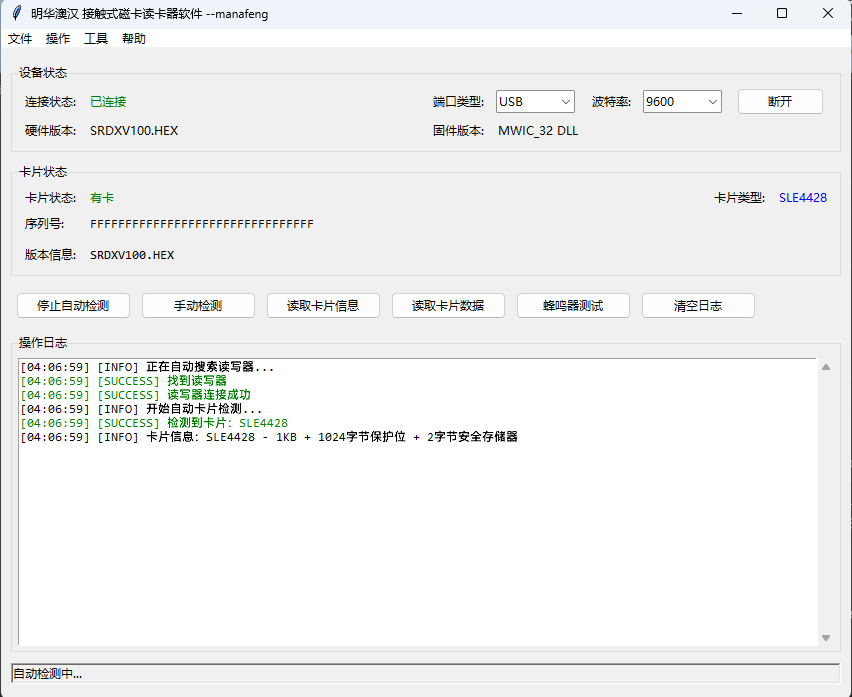

# Mingwah-SRD-U100

明华澳汉 SRD-U100 接触式 IC 卡读写器程序，提供 GUI 和 CLI 两种操作模式。
基于官方MWIC_32.dll库，模拟官方完整版demo实现。


## 功能特性

- 自动搜索并连接读写器（COM / USB / HID 端口）
- 自动检测卡片类型，支持以下卡片：
  - **AT24C 系列 EEPROM**：AT24C01A / 02 / 04 / 08 / 16 / 32 / 64
  - **SLE 系列**：SLE4442 / SLE4428 / SLE4418
  - **AT88C 系列**：AT88C102 / 1604 / 1608 / AT88SC153 / AT88SC1604B
  - **CPU 卡**（ATR 读取）
- 卡片数据读取、编辑与写入
- SLE4442 / SLE4428 密码验证与修改
- 保护位读取与写入
- 数据导入/导出（二进制文件）
- 蜂鸣器控制
- GUI 十六进制编辑器，支持实时修改高亮
- **CPU卡暂未支持读写操作，因为我手头没有接触式CPU卡，有需要者可以自行实现，或者V我几张CPU卡，加速我的实现。**

## 环境要求

- Windows 操作系统
- Python 3.8+（**32 位**，因 MWIC_32.dll 为 32 位库）
- 明华澳汉 SRD-U100 读写器

## 安装

```bash
pip install -r requirements.txt
```

依赖项：

- `pyserial>=3.5`

> tkinter 通常随 Python 自带，无需单独安装。

## 使用方法

### GUI 模式（默认）

```bash
python main.py
# 或
python run_gui.py
```

启动后程序会自动搜索读写器，连接成功后进入自动卡片检测模式。

### CLI 模式

```bash
python main.py --cli
```

CLI 模式下支持以下快捷键：

| 按键 | 功能 |
|------|------|
| `r` | 读取卡片全部数据 |
| `i` | 读取卡片信息 |
| `q` | 退出程序 |

### 查看版本

```bash
python main.py --version
```

## 项目结构

```
Mingwah-SRD-U100/
├── main.py                  # 主入口（GUI/CLI 切换）
├── run_gui.py               # GUI 快速启动脚本
├── requirements.txt         # 依赖列表
├── src/
│   ├── core/
│   │   ├── constants.py     # 常量定义（错误码、端口、波特率等）
│   │   ├── types.py         # 类型定义（CardType、DeviceStatus 等）
│   │   ├── mwic.py          # MWIC_32.dll 封装（ctypes 调用）
│   │   └── detector.py      # 自动卡片检测与数据读写
│   ├── gui/
│   │   ├── app.py           # 主 GUI 窗口
│   │   ├── card_editor.py   # 卡片数据十六进制编辑器
│   │   └── password_dialogs.py  # 密码验证/修改对话框
│   └── protocols/
└── LICENSE                  # AGPL-3.0
```

## 支持的卡片类型

| 卡片类型 | 容量 | 保护位 | 安全存储器 | 密码验证 |
|----------|------|--------|-----------|---------|
| AT24C01A | 128 B | - | - | - |
| AT24C02 | 256 B | - | - | - |
| AT24C04 | 512 B | - | - | - |
| AT24C08 | 1 KB | - | - | - |
| AT24C16 | 2 KB | - | - | - |
| AT24C32 | 4 KB | - | - | - |
| AT24C64 | 8 KB | - | - | - |
| SLE4442 | 256 B | 32 B | 4 B | PSC (3 字节) |
| SLE4428 | 1 KB | 1024 B | 2 B | PSC (2 字节) |
| SLE4418 | 1 KB | 1024 B | - | - |
| AT88C102 | 128 B | - | - | - |
| AT88C1604 | 2 KB | - | - | - |
| AT88C1608 | 2 KB | - | - | - |
| AT88SC153 | 128 B | - | - | - |
| AT88SC1604B | 2 KB | - | - | - |

## 许可证

[AGPL-3.0](LICENSE)
